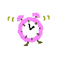

 
# **Cooking Timer** 
**Cooking Timer es una sencilla aplicación de escritorio que permite gestionar múltiples temporizadores, ideal para seguir diferentes procesos de cocina.**

## Instalación
*Clona este repositorio:*

https://github.com/micadlh/cooking-timer.git

*instala node_modules*

npm install

### Funcionalidad
Iniciar, pausar y restablecer temporizadores.
Visualización de tiempo restante para cada temporizador.
### Tecnologías utilizadas
- HTML
- CSS
- JavaScript
- Node.js
